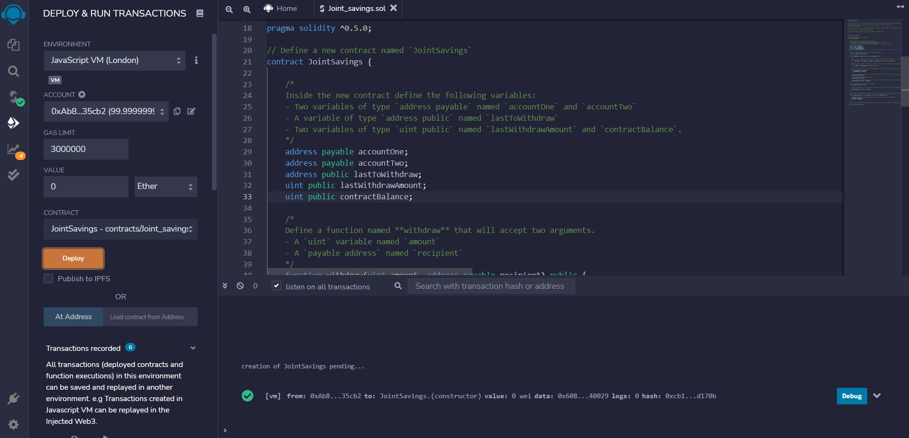
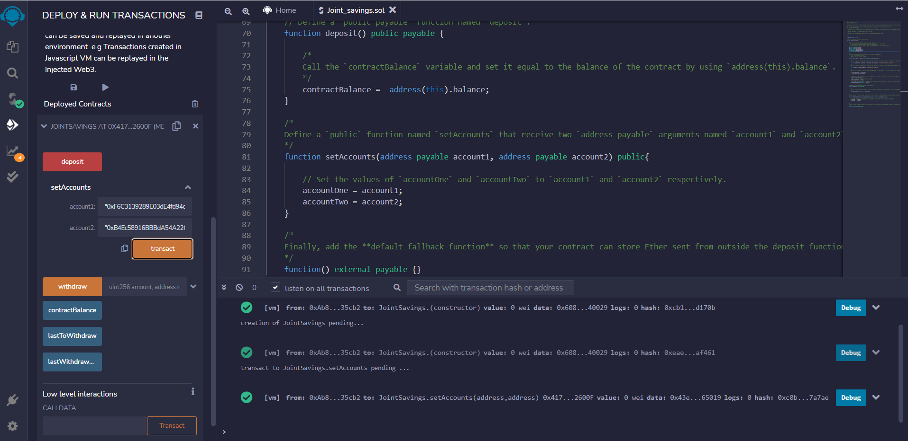
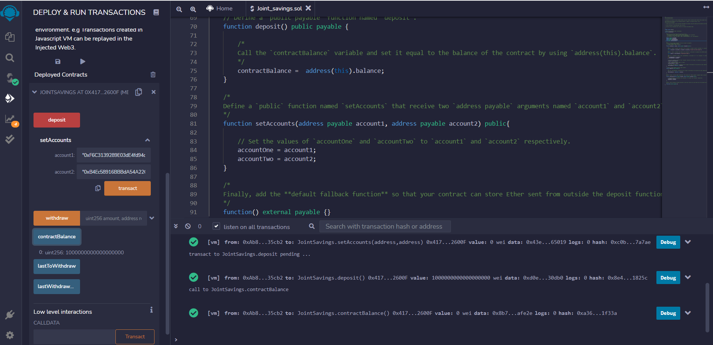
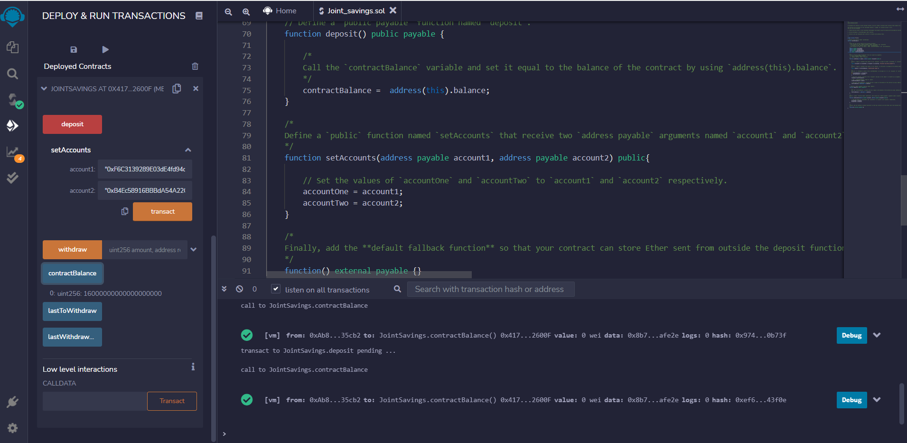
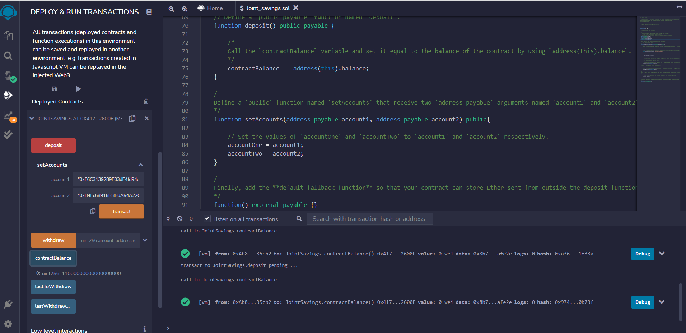
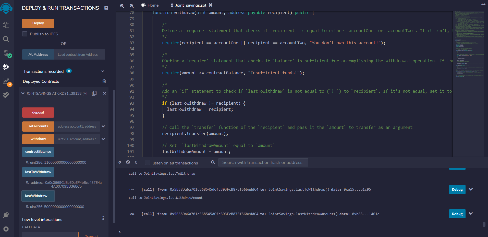
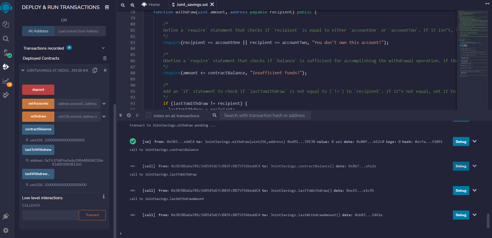

# Commercial Bank Joint Accounts
___________
A Solidity smart contract that accepts two user addresses. These addresses will be able to control a joint savings account. The smart contract will use ether management functions to implement a financial institution’s requirements for providing the features of the joint savings account. These features will consist of the ability to deposit and withdraw funds from the account.
___________

## Smart Contract Life Cycle:

* Define the business scenario where we want to use a smart contract.

* Architect the functionality of the smart contract, and define the functions.

* Create the code that implements the solution that we want to build.

* Compile the smart contract in the Remix IDE. If any errors occur, fix them.

* Deploy the smart contract in the Ethereum network.

## Instructions:

1. Create a Joint Savings Account Contract in Solidity: [Remix Web IDE](https://remix.ethereum.org/)

2. Compile and Deploy Your Contract in the JavaScript VM: `joint_savings.sol`

3. Interact with Your Deployed Smart Contract:

* Use the `setAccounts` function to define the authorized Ethereum address that will be able to withdraw funds from the contract.

* Deposit 1ETH:

* Deposit 5ETH:

* Deposit 10ETH:

* Withdraw into AccountOne 5ETH:

* Withdraw into AccountTwo 10ETH:

