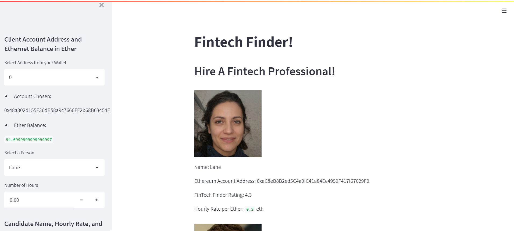
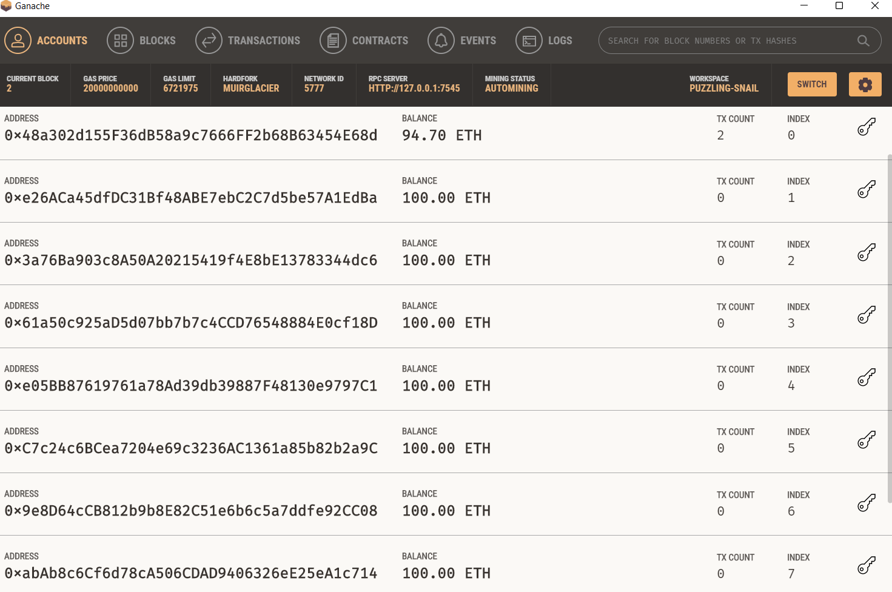
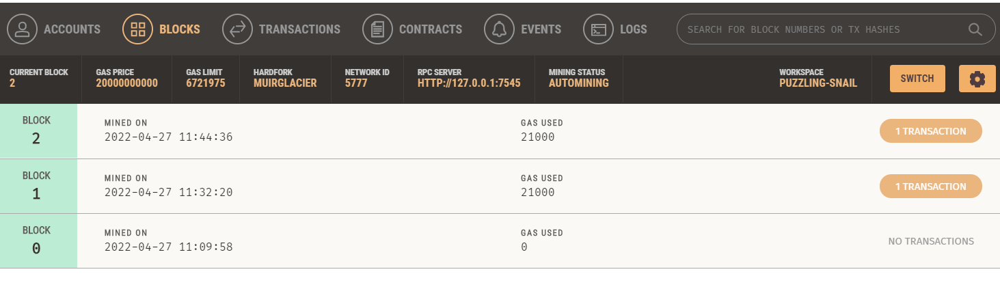
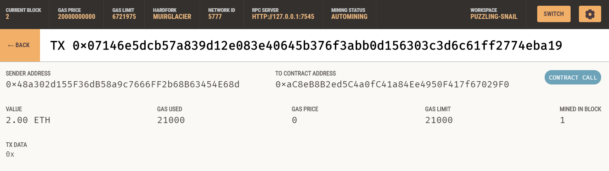
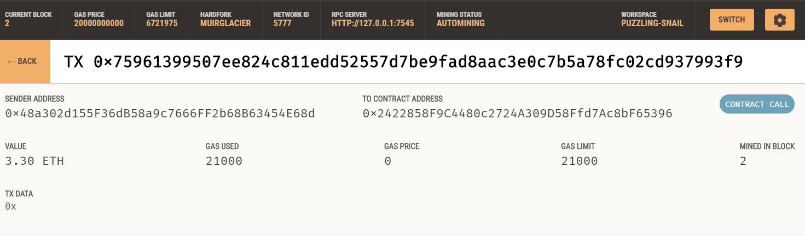
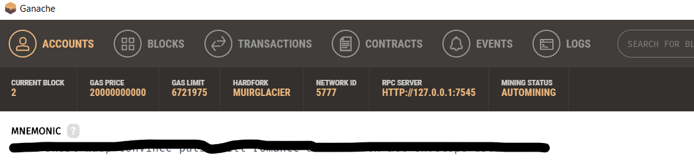

# Ether Payment System
_______

A build of a blockchain-based etherum payment system MVP, complete with a user-friendly web interface. This web appllication allows customers to find fintech professionals from among a list of candidates, hire them, and pay them.   The web app is integrating the Ethereum blockchain network into the application in order to enable customers to instantly pay the fintech professionals whom they hire with cryptocurrency.
______

## Application Interface:

### Main Page:
<p style="text-align:center;"></p>

### Transaction
* Account Balance:
After two transactions, paying two different people, this is how our chosen balance looks like in ganache
<p style="text-align:center;"></p>

* Blocks Created:
Each transaction was stored in a separaet block (in real life many transaction are stored in one block):
<p style="text-align:center;"></p>

* Detailed Transactions:
<p style="text-align:center;"></p>

<p style="text-align:center;"></p>

We paid out a total of 5.3 ethers that left us with 94.7 ethers in our first balance!


## Steps to run the application:
__________________________________
### Installations
* Open Anaconda terminal and pass the commands in order
```python
conda create -n env_whatever_name python==3.7.2+ (i.e. any python version above 3.7.1)
conda activae env_whatever_name
pip install streamlit
pip install web3==5.17
pip install eth-tester==0.5.0b3
pip install mnemonic
pip install bip44
```
* Download Ganache (local dummy blockchain):  [Ganache Site](https://www.trufflesuite.com/ganache)
When you have installed ganache and opened it, copy the long phrase you see on the top. For refference (whatever is behind the black highlight):
<p style="text-align:center;"></p>

Then, create a '.env' file using any editor like notepad and paste in it: 
```bash
MNEMONIC = "Whatever you copied from Ganache"
```


### Path Setting

* Save the folder you cloned on your desktop and `cd` to `~/Desktop/Blockchain_Upskilling/Ether_Payment_System`

### Run

* Pass in next command in same open terminal after completing prior steps in order

```python
streamlit run fintech_finder.py
```
### Executable File

This file is custom to the path of where you saved this code. I have it set to point to my directory. Thus edit it in notebad or vscode 
to set right path and right conda env name and save file as "executable.bat". Make sure to wrape the name between two "" in order for it
to convert to a .bat(batch) windows execuatble file.


