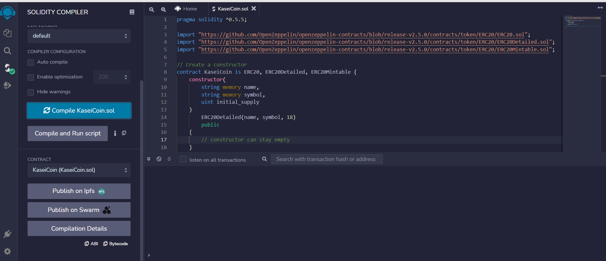
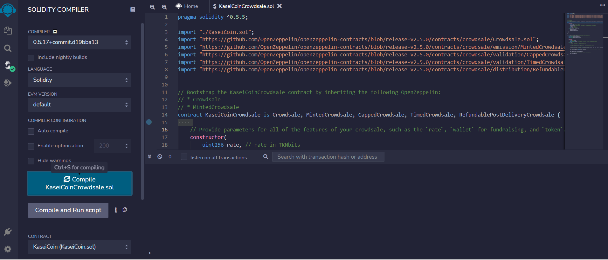

# Crowdsale via Intial Coin Offering (ICO)
_____
A prototype blurprint for a new monetary system on blockchain technology, and to define a new cryptocurrency called KaseiCoin (hypothetical example). (“Kasei” means “Mars” in Japanese.) KaseiCoin will be a fungible token that is ERC-20 compliant. A crowdsale will be launched that will allow participants to convert their fiat money to KaseiCoin(hypothetical coin example).
______

## Crowdsale ICO Life Cycle:
* Create the KaseiCoin token contract.

* Create the KaseiCoin crowdsale contract.

* Create the KaseiCoin deployer contract.

* Perform a real-world, pre-production test of your crowdsale. In order to do so, you will deploy the crowdsale to a local blockchain by using Remix, MetaMask, and Ganache.

## Instructions:

1. Create a KaseiCoin & KaseiCoinCrowdsale Contract in Solidity: [Remix Web IDE](https://remix.ethereum.org/)
* Injected Web3 (remix) creates link between `Remix` and `Metamask`
* Selection of the `Metamask` network and accounts creates link between it and `Ganache`

2. Compile and Deploy Your Contract in the JavaScript VM: `KaseiCoin.sol`

3. Compile and Deploy Your Contract in the JavaScript VM: `KaseiCoinCrowdsale.sol`

## Evaluation Evidence

